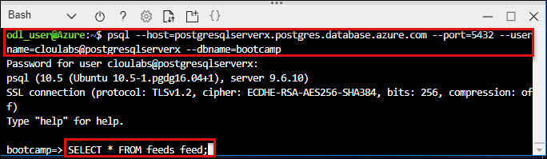

# Module 1: Using Azure Database for PostgreSQL to Run a Python Application

## Overview
Azure Database for PostgreSQL is a PostgreSQL database service built on Microsoft's scalable cloud infrastructure for application developers.
Leverage your existing open-source PostgreSQL skills and tools and scale on-the-fly without downtime to efficiently deliver existing and new applications with reduced operational overhead.
Built-in features maximize performance, availability, and security. Azure Database for PostgreSQL empowers developers to focus on application innovation instead of database management tasks.

An Azure Resource Group is a logical container into which Azure resources are deployed and managed. A Resource Group and a Storage Account must exist before any virtual machines can be created. In this example, a resource group already created in the some region. You will need to use resource group name while creating your Database and Server.

Throughout this lab, we will use the **Azure Command Line Interface** or **Azure CLI** using the **Cloud Shell** feature in the **Azure Portal**.

## Scenario Overview

This hands-on lab will step you through the following:

1.1 :   **Create an Azure storage account and initialize Azure Cloud Shell for Azure CLI.**<br/>
1.2 :	  **Create an Azure Database for PostgreSQL instance.**<br/>
1.3 :   **Create and connect to your PostgreSQL database using psql.**<br/>
1.4 :   **Create an Ubuntu Azure VM.**<br/>
1.5 :   **Configure the Bootcamp Application.**<br/>


## 1.1:	Create an Azure storage account and initialize Azure Cloud Shell for Azure CLI.

1.  **Navigate** to https://portal.azure.com and login (from provided credentials).
2.  **Enter** the **Username** which was displayed in the previous window and **click** on **Next**.<br/>
<br/>
3.	In the Stay signed in? pop-up window, click **No**. **Enter** the **Password** and click on **Sign in**.<br/>
<br/>
4.	In the Welcome to **Microsoft Azure** pop-up window, click **Maybe Late**r. Initialize the **Azure CLI**.
5.	To launch the **Azure Cloud Shell**, click the **Cloud Shell** button on the menu in the top menu bar of the Azure portal. The button launches an interactive shell that you can use to run all of the steps required to create and manage an Ubuntu Linux VM.<br/>
<br/>
6.	Once the shell launches, you will see **Welcome to Azure Cloud Shell**. Click on the **Bash (Linux)** option at the bottom.<br/>
<br/>
7.	In the **You have no storage mounted** tab, click on **Show Advanced Settings**.<br/>
<br/>
8.	In the **Advanced Settings** tab, use the existing **Resource Group** and enter a unique name for the **Storage Account** and **File Share**.<br/>
<br/>
9.	Click **Create Storage**.
10. Once the storage gets created, your **Cloud Shell** will initialize and very shortly be ready to use.<br/>
<br/>

   > Note: the Resource Group name, the Storage Account, and the File Share you created are displayed in the CLI while it initializes.
You may enlarge the shell by dragging the border or clicking on the maximize button on ht etop right of the shell.

## 1.2:	Create an **Azure Database for PostgreSQL** instance

1. A server contains a group of databases. You can create an **Azure Database for PostgreSQL** server using the **az postgres server create** command. Edit the following command as per below:<br/>
* **--resource-group :** Give your **onpremisesrg** Resourse Group name
* **--name :** Give any unique name for your **Postgresql server**
* **--location :** **southcentralus**
* **--admin-user :** **cloudlabs**
* **--admin-password :** Give **Password** for your server
* **--sku-name :** **GP_Gen4_2** 
* **--storage-size :** **51200**
Then copy and paste in **Azure Cloud Shell** command line.
```
az postgres server create --resource-group <resource group name> --name <postgresql server name> --location southcentralus --admin-user <admin name> --admin-password <password> --sku-name GP_Gen4_2 --storage-size 51200
```
<br/><br/>

     > Note: Be sure to remember your user name and password as you will need to use it later for your connection information.
     
2.	Hit **Enter**.
The result is output to the screen in JSON format as shown in the example below. Make a note of the **administratorLogin** and **fullyQualifiedDomainName**.<br/><br/>

     > Note: Your fullyQualifiedDomainName will be servername.postgres.database.azure.com
     
 ```
 {
  "administratorLogin": "pgsqluser", //fullyQualifiedDomainName
  "fullyQualifiedDomainName": "pqsql123456.postgres.database.azure.com", //fullyQualifiedDomainName
  "id": "/subscriptions/00000000-0000-0000-0000-000000000000/resourceGroups/myresourcegroup/providers/Microsoft.DBforPostgreSQL/servers/mypgserver-20170401",
  "location": "southcentralus",
  "name": "pqsqlrg123456",
  "resourceGroup": "rg123456",
  "sku": {
    "capacity": 50,
    "family": null,
    "name": "PGSQLS2M50",
    "size": null,
    "tier": "Basic"
  },
  "sslEnforcement": null,
  "storageMb": 51200,
  "tags": null,
  "type": "Microsoft.DBforPostgreSQL/servers",
  "userVisibleState": "Ready",
  "version": "9.6"
  }
  ```
3.	Create an **Azure PostgreSQL server-level firewall** rule with the **az postgres server firewall-rule create** command. A server-level firewall rule allows an external application, such as psql or PgAdmin to connect to your server through the **Azure PostgreSQL service firewall**. Edit the command as shown below:<br/>
* **--resource-group :** Give your **onpremisesrg** Resourse Group name
* **--server :** Give name of your **Postgresql server**
```
az postgres server firewall-rule create --resource-group <resource group name>  --server <server name> --name AllowAllIps --start-ip-address 0.0.0.0 --end-ip-address 255.255.255.255
```
<br/>
4.	Hit **Enter**.<br/>
5.	Now let's get the connection information for your new **PostGreSQL Azure Database Server**. To connect to your server, you need to provide host information and access credentials.
* **--resource-group :** Give your **onpremisesrg** Resourse Group name
* **--server :** Give name of your **Postgresql server**
```
az postgres server show --resource-group <resourcegroupname> --name <server name>
```
<br/>
6.	Hit **Enter**.

## 1.3:  Create and connect to your PostgreSQL database using psql

1. Go to **ODL-XXXXX-opremisesrg** Resource Group, click on **Postgresql Server** from overview section copy the **Server name** and **Server admin login name** and make note for this.<br/>
<br/>
2. Edit the following psql command with **Server name** and **Server admin login name** and copy paste in **Azure Cloud Shell** and hit **Enter**:
```
psql --host=<server name> --port=5432 --username=<server admin login name> --dbname=postgres
```
<br/>

3.	You will be prompted for a password. Type your **Password** at the prompt and hit **Enter**.<br/>
    
    >Important Note: the psql prompt will not echo what you type. Use care to type or paste the password into the CLI window exactly. If you see the error "FATAL: SSL connection is required." your password may not have been accepted and you should repeat the psql command above and re-enter the password carefully.
    
4.	Once you are connected to the server with psql, create a blank database for your Python app to use. At the prompt, type the following command and hit **Enter**:
```
create database bootcamp;
```
5.	The Bootcamp database is now created. To connect to it and confirm it was created, type the following command and hit **Enter**:
```
\c bootcamp;
```
6.	Exit psql and return to the Azure Cloud Shell prompt. Type the following command and hit **Enter**:
```
\q
```
<br/>

## 1.4:	 Create an Ubuntu Azure VM

1.	Create a virtual machine with the **az vm create** command in cloud shell. When creating a virtual machine, several options are available such as operating system image, disk sizing, and administrative credentials. In this example, a virtual machine is created with a name of **myubuntu** running Ubuntu Server. Edit the command and copy paste in **Azure Cloudshell**
* **--resource-group :** Give your **onpremisesrg** resource group name
* **--name :** **myubuntu**
* **--vnet-name :** **myvnet** 
* **--image :** **ubuntults**

```
az vm create --resource-group <resource group name> --name myubuntu --vnet-name myvnet --image ubuntults --generate-ssh-keys
```
<br/>
2.	Hit **Enter**.

  >Note: Once the VM has been created, the Azure CLI outputs information about the VM. Take note of the publicIpAddress, this address can be used to access the virtual machine..
  
```
{    
 "fqdns": "",
 "id": "/subscriptions/d5b9d4b7-6fc1-0000-0000-000000000000/resourceGroups/myResourceGroupVM/providers/Microsoft.Compute/virtualMachines/myVM",
 "location": "southcentralus",
 "macAddress": "00-0D-3A-23-9A-49",
 "powerState": "VM running",
 "privateIpAddress": "10.0.0.4",
 "publicIpAddress": "xxx.xxx.xxx.xxx",
 "resourceGroup": "rg123456"
}
```
   >Note: If you should get a "Cloud Shell timed out" in the Azure Bash Shell, select reconnect. Once the shell provisions again, you may continue with your next step.
   
   >Note: To find the public IP address for the Ubuntu Server go to the Azure Portal and Select Virtual Machines from the resource Blade.
   
3. Select **MyUbuntu** from the **Virtual Machine** List. Highlight **Overview** and view the **Public IP address** on the right side.<br/>

<br/>
4.	By default, only **SSH connections** are allowed into **Linux virtual machines** deployed in Azure. This VM is going to be a webserver, so you need to open a port from the Internet. Use the **az vm open-port** command to open the desired port.
```
az vm open-port --port 8000 --resource-group <onpremisesrg resource group name> --name <virtual machine name>
```
<br/>
5.	Hit **Enter**.<br/>
6.	Connect to the VM using SSH in the Azure CLI.
```
ssh [publicIpAddress]
```
<br/>
   >Note: Replace [publicIpAddress] with the IP address of your server (without brackets) noted in the previous step (2).
7.	Hit **Enter**.
8.	When prompted to continue, type **yes** and hit **Enter**.

## 1.5: Configure the Bootcamp Application

1.	Now you are at the shell of your new **Ubuntu VM**. Let's update the package index in Ubuntu, so that we have a recent list of the package repository
2.	In your shell, type the following command and hit **Enter**:
```
sudo apt update
```
3.	Now let's install the **Python Package Index**. Type the following command and hit **Enter**:
```
sudo apt install python3-pip
```
   >Note: When prompted to provide a y/n, answer y.
   
4.	We are now ready to install our **Bootcamp application** that we will use with **PostgreSQL**. We will need to download a copy from GitHub.
5.	To connect to **GitHub** and pull the code for **Bootcamp**, type the following command and hit **Enter**:
```
git clone https://github.com/vitorfs/bootcamp.git 
```
<br/>
  >Note: Feel free to browse to Github and have a look at the Bootcamp repo to learn about what the application does: https://github.com/vitorfs/bootcamp.git 
  
6.	In your shell, type the following and hit **Enter**:
```
cd bootcamp
```
7.	Select release **1.0.4** of the Bootcamp application, In your shell, type the following and hit **Enter**:
```
git reset --hard c15452cef893b36fb9f82dda0239983333c3ecf4
```
<br/>
8.	**Run** the following command to install the extension tool.
```
sudo apt-get install postgresql-server-dev-all
```
9.	Now install **Django**.
```
sudo pip3 install --upgrade django
```
10.	Now we will install the **Django Framework** requirements for the **Python app**. Type the following command and hit **Enter**:
```
pip3 install -U -r requirements/local.txt
```
11.	Now install the **redis server package**.
```
sudo apt-get install redis-server
```
  >Note: When prompted to provide a y/n, answer y
  
12.	To list the files in the **../bootcamp** directory, use the **ls** command.
   >Note: You will need to run some of these commands as root. To do this, type "sudo" then the command you wish to run.
Type the following command and hit **Enter**:
```
sudo ls -la
```
   >Note: the manage.py script that was installed when we cloned the Git repository.
13.	While still in the **../bootcamp** directory, type the following command and hit **Enter**:
```
vim .env 
```

14. Enter the following lines to create your database connection environment file:
A: You are now in the **VIM Editor**. Type i to **Enter** INSERT mode.
B: Edit the following command with your PostgreSQL sever name and password. Then Copy and Paste into the **vim editor**.
```
DEBUG=True
SECRET_KEY='mys3cr3tk3y'
DATABASE_URL='postgres://<server admin login name>:<Password>@<server name>:5432/bootcamp'
ALLOWED_HOSTS = "*"
```
For Example:
```
DEBUG=True
SECRET_KEY='mys3cr3tk3y'
DATABASE_URL='postgres://pgsqluser@postgresql:P@ssword1@postgresql.database.windows.net:5432/bootcamp'
ALLOWED_HOSTS = "*"
```
   >Note: If you look at the credentials closely, you will notice we are using the new Azure Database for PostgreSQL service to connect to this app, and we have pre-populated the connection string.
15.	On the **VIM Editor Terminal**, to come out of the editing mode.<br/>
* Press the **ESC** key.<br/>
* Type **:wr** and hit **Enter**. This writes in the file **.env** and saves it.<br/>
* Type **:q** and hit **Enter** to leave VIM.<br/>
16.	Next, we need to allow the host to communicate outside of the environment. Change the directory to bootcamp/config/settings
```
cd config/settings
```
17.	Type the following command to open the **local.py** file.
```
vim local.py
```
18.	Append the **ALLOWED_HOSTS** parameter.

*  Type **i** to enter **INSERT** mode.

*  Look for the **ALLOWED_HOSTS** parameter and **Add** "*", **after** "127.0.0.1". Be sure to separate "127.0.0.1" and * with a **comma**.  

19.	**Save** the changes to **local.py**.<br/>
* **Press** the **ESC** key.<br/>
*  Type **:wr** and hit **Enter**.<br/><br/>

20.	Change the directory back to bootcamp with following comand.
```
cd ~/bootcamp
```
21.	To run migration and serve the app, type the following command and hit **Enter**:
```
python3 manage.py migrate
```
22.	Let's bring the server up. Type the following command and hit **Enter**:
```
python3 manage.py runserver 0.0.0.0:8000
```
23.	Now, open a new web browser window, enter the following URL, and hit **Enter**:
```
http://[publicIpAddress]:8000/
```
  >Important Note: Replace [publicIpAddress] with the IP address of your server (without brackets) from Create an Azure VM running Ubuntu Server-Step 3.
  
 <br/>
  
24.	With the bootcamp app open in your browser, sign up for the bootcamp.

  >Note: Enter a username; provide an email address; create a password; then create your account
  >Note: The next screen you would see after successful creation of the account is this:
<br/>
25.	Let's go to the database and query it directly. Return to Azure Cloud Shell where you have the SSH session and hit Ctrl-C to terminate the web server.

26.	Next, let's terminate our SSH session to **Ubuntu**. Type the following command and hit **Enter**:
```
exit
```
27.	Now, let's connect to the **Azure PostgreSQL database**. Type the following and hit **Enter**:
```
psql --host=<servver name> --port=5432 --username=<server admin login name> --dbname=bootcamp 
```
<br/>

28.	If prompted for a password, type P@ssword1 at the prompt and hit **Enter**.

  >Note: the psql shell will not echo what you type.
29.	Type in the following command and hit **Enter**.
```
SELECT * FROM feeds_feed;
```
You should now see the username you registered in Bootcamp in this table.
<br/>

### Conclusion

In a relatively short amount of time, we were able to git clone an app running on the Python Django framework, using a PostgreSQL database in the backend.
We changed the connection string to a provisioned Azure Database for PostgreSQL, and then connected the Bootcamp application in Azure.
When we ran the application and registered a username for "Bootcamp", we were able to see that the username existed in our Azure Database for PostgreSQL.
With this simple installation, you can utilize many tools for PostgreSQL such as PostGIS, PGAdmin, pgScale, etc.
