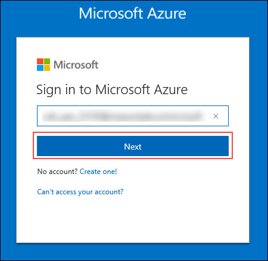
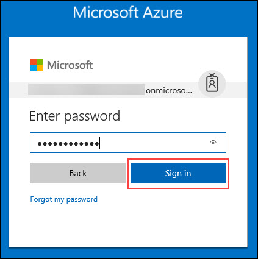
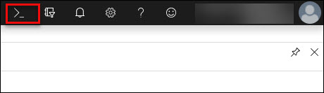
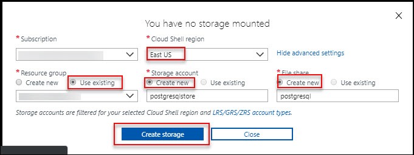
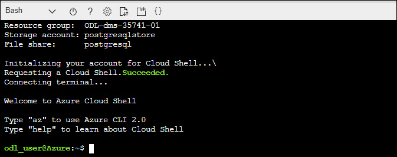
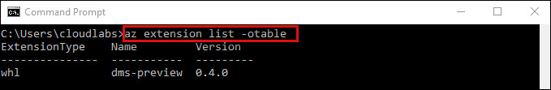

# Module 2: Migrate PostgreSQL to Azure Database for PostgreSQL online using DMS

You can use the Azure Database Migration Service to migrate the databases from an on-premises PostgreSQL instance to Azure Database for PostgreSQL with minimal downtime. In other words, migration can be achieved with minimum downtime to the application. In this tutorial, you migrate the DVD Rental sample database from an on-premises instance of PostgreSQL 9.6 to Azure Database for PostgreSQL by using an online migration activity in the Azure Database Migration Service.

In this tutorial, you learn how to:

**Exercise 1:  Create an Azure storage account and initialize Azure Cloud Shell Azure CLI**<br/>
**Exercise 2:  Create an Azure Database for PostgreSQL instance**<br/>
**Exercise 3:  Connect to the PostgreSQL Database by using psql in Cloud Shell**<br/>
**Exercise 4:  Migrate the sample schema using pgdump utility**<br/>
**Exercise 5:  Create an instance of the Azure Database Migration Service**<br/>
**Exercise 6:  Create a migration project by using the Azure Database Migration Service**<br/>
**Exercise 7:  Run the migration**<br/>
**Exercise 8:  Monitor the migration**<br/>

**Important**

* For an optimal migration experience, Microsoft recommends creating an instance of the Azure Database Migration Service in the same Azure region as the target database. Moving data across regions or geographies can slow down the migration process and introduce errors.

* Escape **Exercise 1** and **Exercise 2**, if you already did in Module 1. Use same credential for this Module.

## Exercise 1:	Create an Azure storage account and initialize Azure Cloud Shell for Azure CLI. 

1.  **Navigate** to https://portal.azure.com and login (from the provided credentials).
2.  **Enter** the **Username** which was displayed in the previous window and **click** on **Next**.<br/>
<br/>
3.	In the Stay signed in? pop-up window, click **No**. **Enter** the **Password** and click on **Sign in**.<br/>
<br/>
4.	In the Welcome to **Microsoft Azure** pop-up window, click **Maybe Late**r. Initialize the **Azure CLI**.
5.	To launch the **Azure Cloud Shell**, click the **Cloud Shell** button on the menu in the top menu bar of the Azure portal. The button launches an interactive shell that you can use to run all of the steps required to create and manage an Ubuntu Linux VM.<br/>
<br/>
6.	Once the shell launches, you will see **Welcome to Azure Cloud Shell**. Click on the **Bash (Linux)** option at the bottom.<br/>
<br/>
7.	In the **You have no storage mounted** tab, click on **Show Advanced Settings**.<br/>
<br/>
8.	In the **Advanced Settings** tab, use the existing **Resource Group** and enter a unique name for the **Storage Account** and **File Share**.<br/>
<br/>
9.	Click **Create Storage**.
10. Once the storage gets created, your **Cloud Shell** will initialize and very shortly be ready to use.<br/>
<br/>

   > Note: the Resource Group name, the Storage Account, and the File Share you created are displayed in the CLI while it initializes.
You may enlarge the shell by dragging the border or clicking on the maximize button on ht etop right of the shell.


## Exercise 2:	Create an **Azure Database for PostgreSQL** instance

1. A server contains a group of databases. You can create an **Azure Database for PostgreSQL** server using the **az postgres server create** command. Copy and paste the following into the **Azure** command line:<br/>
* **--resource-group :** Give your **onpremisesrg** Resourse Group name
* **--name :** Give any unique name for your **Postgresql server**
* **--location :** Give your **Resource Group** location
* **--admin-user :** **cloudlabs**
* **--admin-password :** Replace <password> with 'Password!1234'
* **--sku-name :** **GP_Gen4_2** 
* **--storage-size :** **51200**
```
az postgres server create --resource-group <resource group name> --name <postgresql server name> --location <existing resource group name> --admin-user <admin name> --admin-password '<password>' --sku-name GP_Gen4_2 --storage-size 51200
```
if you have a sign of exclamation in password etc, put the string in quotes to avoid bash conflict.

<br/><br/>

     > Note: Be sure to remember your user name and password as you will need to use it later for your connection information.
     
2.	Hit **Enter**.
The result is output to the screen in JSON format as shown in the example below. Make a note of the **administratorLogin** and **fullyQualifiedDomainName**.<br/><br/>
     > Note: Your fullyQualifiedDomainName will be servername.postgres.database.azure.com
 ```
 {
  "administratorLogin": "pgsqluser", //fullyQualifiedDomainName
  "fullyQualifiedDomainName": "pqsql123456.postgres.database.azure.com", //fullyQualifiedDomainName
  "id": "/subscriptions/00000000-0000-0000-0000-000000000000/resourceGroups/myresourcegroup/providers/Microsoft.DBforPostgreSQL/servers/mypgserver-20170401",
  "location": "southcentralus",
  "name": "pqsqlrg123456",
  "resourceGroup": "rg123456",
  "sku": {
    "capacity": 50,
    "family": null,
    "name": "PGSQLS2M50",
    "size": null,
    "tier": "Basic"
  },
  "sslEnforcement": null,
  "storageMb": 51200,
  "tags": null,
  "type": "Microsoft.DBforPostgreSQL/servers",
  "userVisibleState": "Ready",
  "version": "9.6"
  }
  ```
3.	Create an **Azure PostgreSQL server-level firewall** rule with the **az postgres server firewall-rule create** command. A server-level firewall rule allows an external application, such as psql or PgAdmin to connect to your server through the **Azure PostgreSQL service firewall**.<br/>
```
az postgres server firewall-rule create --resource-group <resource group name>  --server <server name> --name AllowAllIps --start-ip-address 0.0.0.0 --end-ip-address 255.255.255.255
```
<br/>
4.	Hit **Enter**.<br/>
5.	Now let's get the connection information for your new **PostGreSQL Azure Database Server**. To connect to your server, you need to provide host information and access credentials.
```
az postgres server show --resource-group <resourcegroupname> --name <server name>
```
<br/>
6.	Hit **Enter**.


## Exercise 3: Connect to the PostgreSQL Database by using psql in Cloud Shell

There are a number of applications you can use to connect to your Azure Database for PostgreSQL server. Let's first use the psql command-line utility to illustrate how to connect to the server. You can use a web browser and Azure Cloud Shell as described here without the need to install any additional software. If you have the psql utility installed locally on your own machine, you can connect from there as well.

1.	In the top navigation pane, select the terminal symbol to open **Cloud Shell**.<br/>
<br/>
2.	Cloud Shell opens in your browser, where you can type **Bash shell** commands.<br/>
<br/>
3.	At the Cloud Shell prompt, connect to a database in your **Azure Database** for **PostgreSQL** server by typing the psql command line. To connect to an **Azure Database for PostgreSQL** server with the psql utility, use the following format:
```
psql --host=<yourserver> --port=<port> --username=<server admin login> --dbname=<database name>
```
For example, the following command connects to an example server:
```
psql --host=mydemoserver.postgres.database.azure.com --port=5432 --username=myadmin@mydemoserver --dbname=postgres
```
<br/>
4. After you run the psql command with your own parameter values, you're prompted to enter the server admin password. This password is the same one that you provided when you created the server.<br/>
5. After you connect, the psql utility displays a postgres prompt where you type sql commands. In the initial connection output, a warning may appear because the psql in Cloud Shell might be a different version than the **Azure Database for PostgreSQL** server version.
Example psql output:
```
psql (9.5.7, server 9.6.2)
WARNING: psql major version 9.5, server major version 9.6.
    Some psql features might not work.
SSL connection (protocol: TLSv1.2, cipher: ECDHE-RSA-AES256-SHA384, bits: 256, compression: off)
Type "help" for help.
postgres=> 
Tip
If the firewall is not configured to allow the IP address of Cloud Shell, the following error occurs:
"psql: FATAL: no pg_hba.conf entry for host "0.0.0.0", user "myadmin", database "postgres", SSL on FATAL: SSL connection is required. Specify SSL options and retry.
To resolve the error, make sure the server configuration matches the steps in the "Configure a server-level firewall rule" section of this article.
```
6.	Create a blank database called **dvdrental** at the prompt by typing the following command:
```
CREATE DATABASE dvdrental;
```
The command might take a few minutes to finish.
7.	At the prompt, execute the following command to switch connections to the newly created database **dvdrental**:
```
\c dvdrental
```
8.	Type \q, and then select the Enter key to quit psql. You can close Cloud Shell after you're finished.<br/>
<br/>
You connected to the Azure Database for PostgreSQL server via psql in Cloud Shell, and you created a blank user database. Continue to the next section to connect by using another common tool, pgAdmin.


## Exercise 4: Migrate the sample schema
To complete all the database objects like table schemas, indexes and stored procedures, we need to extract schema from the source database and apply to the database.<br/>

1. Go to virtual machine, select the **dsm-dev-vm** from the overview section, click on **Connect** button and download **Remote Desktop Connection** for connecting to virtual machine file.<br/>
<br/>
2. Inside the virtual machine click on **Start** button search for **command prompt**, run it as **administrator**.</br> 
<br/>
3. Use **pg_dump** command to create a **schema dump** file for a database.
```
pg_dump -o -h hostname -U db_username -d db_name -s > your_schema.sql
```
**For example**, to dump a schema file **dvdrental** database:
```
pg_dump -o -h localhost -U postgres --no-owner --no-acl -d dvdrental -s  > C:\DMS\dvdrentalSchema.sql
```
<br/>

4. **Import** the schema into the target database you created by restoring the schema dump file.
```
psql -h hostname -U db_username -d db_name < your_schema.sql 
```
**For example:**
```
psql -h postgresqlserverx.postgres.database.azure.com -U cloudlabs@postgresqlserverx -d dvdrental < C:\DMS\dvdrentalSchema.sql
```
<br/>

```
Please note that you will get few access denied errors when importing schema. You can ignore them and proceed
```


## Exercise 5: Provisioning an instance of DMS using the CLI
1. Open another Command Prompt window, run it also as administrator.  

2. Sign in to **Azure** by running the following command:
```
az login
```
3. When prompted, open a web browser and enter a **code** to authenticate your device. Follow the **instructions** as listed.

4. To verify you have **dms extension** installed correct, **run** the following command:
```
az extension list -otable
```      
5. You should see the following output:
```
ExtensionType    Name
---------------  ------
whl              dms
```
<br/>
6. At any time, view all commands supported in **DMS** by running:
```
az dms -h
```

7. Next, create a **PostgreSQL** migration **project** by running the following command:
```
az dms project create -l <location> -g <ResourceGroupName> --service-name <ServiceName> --source-platform PostgreSQL --target-platform AzureDbforPostgreSQL -n <ProjectName>
```
**For example**, the following command creates a project using these parameters:

* Location: **Give your DMS Location**
* Resource Group Name: **Give your cloud rg name here**
* Service Name: **Give your DMS ServiceName**
* Project name: **PGMigration**
* Source platform: **PostgreSQL**
* Target platform: **AzureDbForPostgreSql**
```
az dms project create -l eastus2 -n PGMigration -g PostgresDemo --service-name <Service Name> --source-platform PostgreSQL --target-platform AzureDbForPostgreSql
```
<br/>

8. Create a **PostgreSQL** migration task using the following steps.
This step includes using the **source IP, UserID and password, destination IP, UserID, password,** and **task type** to establish connectivity.

9. To see a full list of options, **run** the command:
```
az dms project task create -h
```
For both **source** and **target** connection, the input parameter is referring to a json file that has the object list.

10. The format of the connection **JSON** object for **PostgreSQL** connections.
```
{
            "userName": "user name",    // if this is missing or null, you will be prompted
            "password": null,           // if this is missing or null (highly recommended) you will be prompted
            "serverName": "server name",
            "databaseName": "database name", // if this is missing, it will default to the 'postgres'
        server
            "port": 5432                // if this is missing, it will default to 5432
        }
```
  >There is also a database option json file that lists the json objects. For PostgreSQL, the format of the database options JSON object is shown below:
```
[
    {
        "name": "source database",
        "target_database_name": "target database",
    },
    ...n
]
```
12. Inside the Virtual machine, go to **C:\DMS** folder and open all files.<br/>
<br/>
13. Edit **source.json** file and then save the file.
```
{
           "userName": "postgres",    
           "password": null,  
           "serverName": "Enter your Virtual machine DNS Name",
           "databaseName": "dvdrental", 
           "port": 5432                
       }
 ```
 <br/>
14. Edit **target.json** file and save it. Include the following commands: 
```
{ 
"userName": "Server Admin Server Name",
"password": null, 
"serverName": "Postgres Server Name", 
"databaseName": "dvdrental",
"port": 5432
}
```
<br/>
15. **Run** the following command, which takes in the **source**, **destination,** and the **DB** option json files.

* Resource Group Name: **Give your cloud rg name here**
* Service Name: **Give your DMS Name**
* Project name: **PGMigration**
* Source platform: **PostgreSQL**
* Target platform: **AzureDbForPostgreSql**
```
az dms project task create -g <resource group name> --project-name <project name> --source-platform postgresql --target-platform azuredbforpostgresql --source-connection-json c:\DMS\source.json --database-options-json C:\DMS\option.json --service-name <Service Name> --target-connection-json c:\DMS\target.json -–task-type OnlineMigration -n runnowtask    
```
At this point, you've successfully submitted a migration task.<br/>
<br/>
16. To show progress of the task, **run** the following command:
```
az dms project task show --service-name <Service Name> --project-name <project name> --resource-group <resource group name> --name <task name>
```
<br/>
17. You can also query for the migration State from the expand output:
```
az dms project task show --service-name <Service Name> --project-name <project name> --resource-group <resource group> --name <task name> --expand output
```
<br/>

Ouput will be look like:<br/>
<br/>


## Exercise 6: Understanding migration task status
In the output file, there are several parameters that indicate progress of migration. For example, see the output file below:
```
"output": [                                 Database Level
      {
        "appliedChanges": 0,        //Total incremental sync applied after full load
        "cdcDeleteCounter": 0       // Total delete operation  applied after full load
        "cdcInsertCounter": 0,      // Total insert operation applied after full load
        "cdcUpdateCounter": 0,      // Total update operation applied after full load
        "databaseName": "dvdrental",
        "endedOn": null,
        "fullLoadCompletedTables": 2,   //Number of tables completed full load
        "fullLoadErroredTables": 0, //Number of tables that contain migration error
        "fullLoadLoadingTables": 0, //Number of tables that are in loading status
        "fullLoadQueuedTables": 0,  //Number of tables that are in queued status
        "id": "db|dvdrental",
        "incomingChanges": 0,       //Number of changes after full load
        "initializationCompleted": true,
        "latency": 0,
        "migrationState": "READY_TO_COMPLETE",  //Status of migration task. READY_TO_COMPLETE means the database is ready for cutover
        "resultType": "DatabaseLevelOutput",
        "startedOn": "2018-07-05T23:36:02.27839+00:00"
      },
      {
        "databaseCount": 1,
        "endedOn": null,
        "id": "dd27aa3a-ed71-4bff-ab34-77db4261101c",
        "resultType": "MigrationLevelOutput",
        "sourceServer": "138.91.123.10",
        "sourceVersion": "PostgreSQL",
        "startedOn": "2018-07-05T23:36:02.27839+00:00",
        "state": "PENDING",
        "targetServer": "builddemotarget.postgres.database.azure.com",
        "targetVersion": "Azure Database for PostgreSQL"
      },
      {                                     Table 1
        "cdcDeleteCounter": 0,
        "cdcInsertCounter": 0,
        "cdcUpdateCounter": 0,
        "dataErrorsCount": 0,
        "databaseName": "dvdrental",
        "fullLoadEndedOn": "2018-07-05T23:36:20.740701+00:00",  //Full load completed time
        "fullLoadEstFinishTime": "1970-01-01T00:00:00+00:00",
        "fullLoadStartedOn": "2018-07-05T23:36:15.864552+00:00",    //Full load started time
        "fullLoadTotalRows": 10,                    //Number of rows loaded in full load
        "fullLoadTotalVolumeBytes": 7056,               //Volume in Bytes in full load
        "id": "or|dvdrental|public|actor",          
        "lastModifiedTime": "2018-07-05T23:36:16.880174+00:00",
        "resultType": "TableLevelOutput",
        "state": "COMPLETED",                   //State of migration for this table
        "tableName": "public.catalog",              //Table name
        "totalChangesApplied": 0                //Total sync changes that applied after full load
      },
      {                                     Table 2
        "cdcDeleteCounter": 0,
        "cdcInsertCounter": 50,
        "cdcUpdateCounter": 0,
        "dataErrorsCount": 0,
        "databaseName": "dvdrental",
        "fullLoadEndedOn": "2018-07-05T23:36:23.963138+00:00",
        "fullLoadEstFinishTime": "1970-01-01T00:00:00+00:00",
        "fullLoadStartedOn": "2018-07-05T23:36:19.302013+00:00",
        "fullLoadTotalRows": 112,
        "fullLoadTotalVolumeBytes": 46592,
        "id": "or|dvdrental|public|address",
        "lastModifiedTime": "2018-07-05T23:36:20.308646+00:00",
        "resultType": "TableLevelOutput",
        "state": "COMPLETED",
        "tableName": "public.orders",
        "totalChangesApplied": 0
      }
    ],                          DMS migration task state
    "state": "Running", //Migration task state – Running means it is still listening to any changes that might come in                  
    "taskType": null
  },
  "resourceGroup": "PostgresDemo",
  "type": "Microsoft.DataMigration/services/projects/tasks"
```


## Exercise 7: Cutover migration task
The database is ready for cutover when full load is complete. Depending on how busy the source server is with new transactions is coming in, the DMS task might be still applying changes after the full load is complete.

To ensure all data is caught up, validate row counts between the source and target databases. For example, you can use the following command:
```
"migrationState": "READY_TO_COMPLETE", //Status of migration task. READY_TO_COMPLETE means database is ready for cutover
 "incomingChanges": 0,  //continue to check for a period of 5-10 minutes to make sure no new incoming changes that need to be applied to the target server
   "fullLoadTotalRows": 10, //full load for table 1
    "cdcDeleteCounter": 0,  //delete, insert and update counter on incremental sync after full load
    "cdcInsertCounter": 50,
    "cdcUpdateCounter": 0,
     "fullLoadTotalRows": 112,  //full load for table 2
```     
1. **Perform** the cutover database migration task by using the following command:
```
az dms project task cutover -h
```
**For example**:
```
az dms project task cutover --service-name <dms name> --project-name <project name> --resource-group <resource group name> --name <task name>  --database-name dvdrental
```
<br/>

2. To monitor the **cutover** progress, run the following command:
```
az dms project task show --service-name <dms name> --project-name <project name> --resource-group <resource group name> --name <task name>
```

## Exercise 8: Service, project, task cleanup
If you need to cancel or delete any DMS task, project, or service, perform the cancellation in the following sequence:* 
* Cancel any running task
* Delete the task
* Delete the project
* Delete DMS service

3. To **cancel** a **running task**, use the following command:
```
az dms project task cancel --service-name <dms name> --project-name <project name> --resource-group <resource group name> --name <task name>
```
<br/>

4. To **delete** a **running task**, use the following command:
```
az dms project task delete --service-name <dms name> --project-name <project name> --resource-group <resource group name> --name <task name>
```
<br/>

5. To **delete** a **running project**, use the following command:
```
az dms project task delete -n <task name> --project-name <project name> --resource-group <resource group name> --service-name <dms name>
```
<br/>

6. To **delete DMS** service, use the following command:
```
az dms delete -g <resource group name> -n <dms name>
```
<br/>
